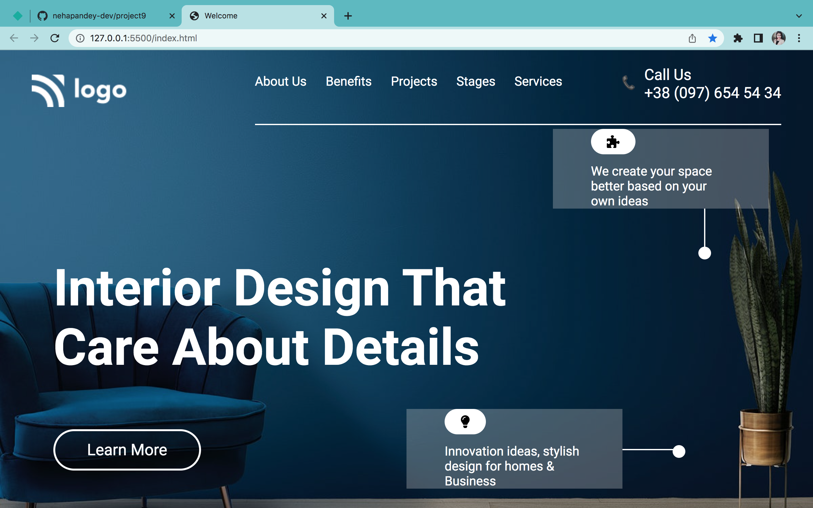

# Project 10
Hello there it's Neha Pandey.

### Project 10 is about interior design home page.

## Challenges
Since in this project ,I had to work on both HTML and CSS so there were lots of challenges for me like-
- created horizontal line after navigation menu
- background size and color
- injected unicode for phone in HTML 
- icons in css 
- flexbox properties
- margin and padding

### ## Total time to complete this project

It took me 5 hours to complete this project.

